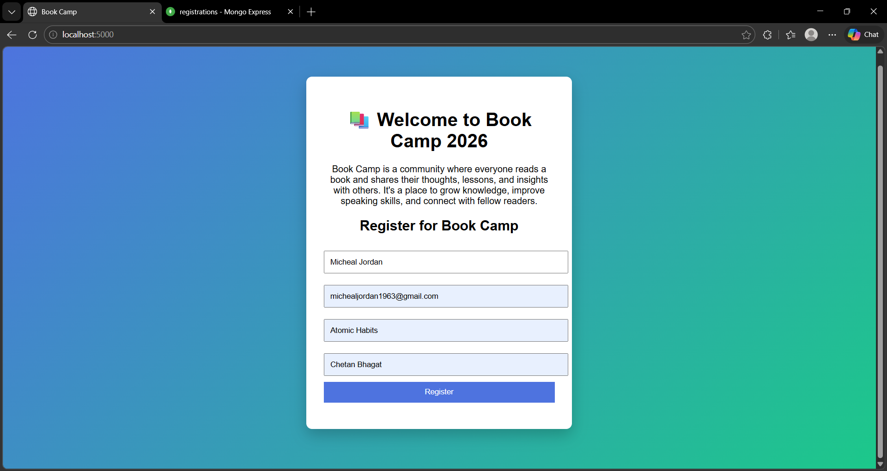
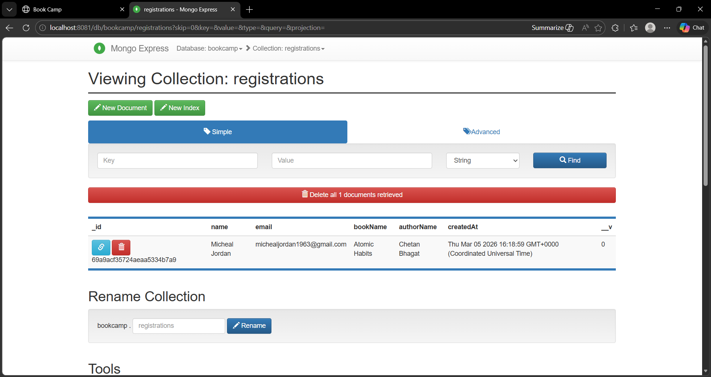
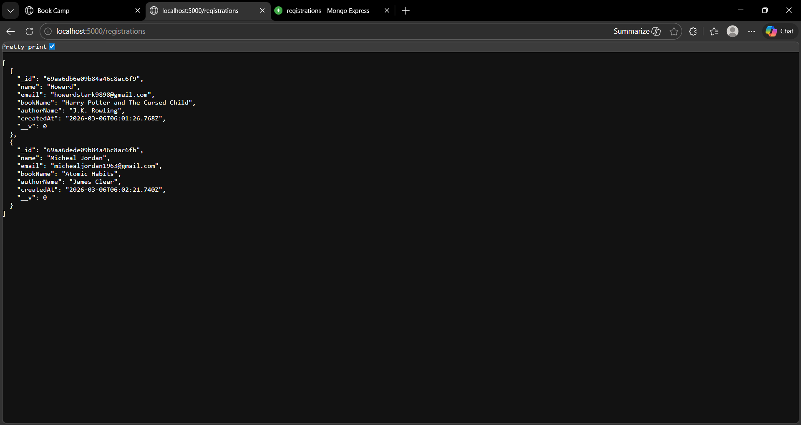

# BookCamp Dockerized Application

This project demonstrates how to containerize a Node.js application using Docker and run it alongside MongoDB using Docker Compose.
The application allows users to register for a Book Camp event and stores the data in MongoDB.

# Project Overview

BookCamp is a simple backend application where users can register for a book camp event.

The project is containerized using Docker and uses Docker Compose to orchestrate multiple services including:

- Node.js backend application
- MongoDB database
- Mongo Express database UI

The application demonstrates how modern applications are deployed using containerized microservices architecture.

# Technologies used

  - Node.js
  - MongoDB
  - Mongo Express
  - Docker
  - Docker Build
  - Docker Compose
  - Docker Hub

# Project Structure

```bash
bookcamp-docker
│
├── app
│   ├── server.js
│   ├── package.json
│   ├── package-lock.json
│   └── models
│       └── registrations.js
│
├── Docker-compose.yaml
├── Dockerfile
├── .dockerignore
├── .gitignore
├── .env
│
├── images
│   ├── architecture1.jpg
│   └── architecture2.jpg
│
├── docs
│   ├── architecture.md
│   └── setup-guide.md
│
├── Document.pdf
└── README.md
```

# Architecture

Reference  [architecture .md](docs/architecture.md)

# Running the project

Reference [setup-guide.md](docs/setup-guide.md) or [Document.pdf](Document.pdf)

# Docker commands used
```bash
docker images
docker ps
docker build -t app:1.0
docker compose up -d
docker compose down
```
see this for more commands [setup commands](docs/setup-guide.md)

# Access

APP:[http://localhost:5000](http://localhost:5000)

MONGO-EXPRESS:[http://localhost:8081](http://localhost:8081)

# Push image to DockerHub

```bash
docker login
docker tag app:1.0 <username>/<repository>:tag
docker tag app:1.0 <username>/myapp:1.0.0
docker push <username>/myapp:1.0.0
```
# Outputs

APPLICATION:

Mongo-Express:

REGISTRATIONS-JSON:



# Real-World Skills Demonstrated

This project demonstrates several DevOps and containerization concepts used in real production environments:

- Docker image creation using Dockerfile
- Multi-container orchestration using Docker Compose
- Container networking
- Service dependency management
- Persistent storage using Docker Volumes
- Containerized database deployment
- Environment isolation using containers
- Microservices-style application architecture
- Image tagging and repository management
- Publishing images to Docker Hub

## Learning Outcomes

Through this project I learned:

- Containerizing Node.js applications
- Managing multi-container applications
- Docker networking concepts
- Persistent storage with Docker volumes
- Docker Compose service orchestration
- Publishing images to container registries


# NOTE:
  for detailed explaination of project details visit  [setup-guide.md](docs/setup-guide.md) & [architecture .md](docs/architecture.md)

📬Author

Manikanta Mangalapalli

DevOps Engineer

GitHub: https://github.com/maniSource-code
