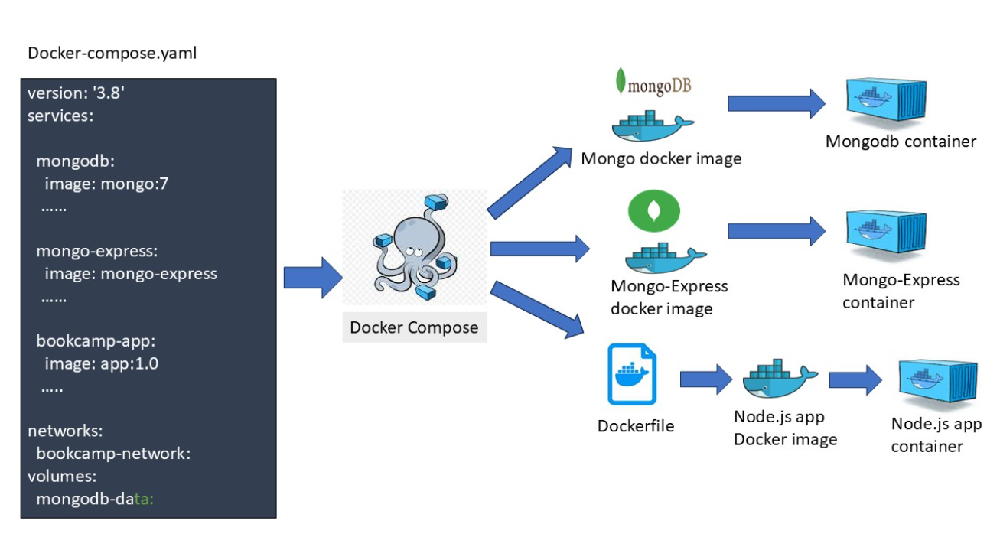
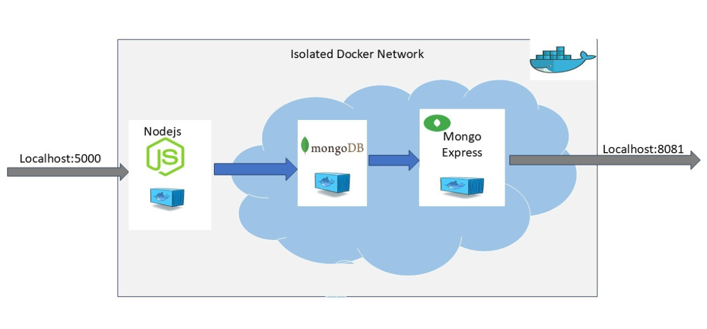

# Architecture

This project uses Docker Compose to run a multi-container application.

The system consists of three containers:

1. **bookcamp-app**
   - Node.js application
   - Handles HTTP requests and stores data in MongoDB

2. **mongodb**
   - MongoDB database container
   - Stores registration data

3. **mongo-express**
   - Web-based MongoDB administration UI
   - Allows viewing and managing database records

Communication:

All services communicate via Docker network: bookcamp-network

Persistent Storage:

MongoDB uses Docker Volume: mongodb-data

# Architecture Diagram

 

# Architecture flow

```bash
Browser
   |
   |  http://localhost:5000
   v
Node.js BookCamp Container
   |
   |  mongodb://mongodb:27017
   v
MongoDB Container
   |
   |  Docker Volume (Persistent Data)
   v
Mongo Express Container
   |
   |  http://localhost:8081
   v  
(Database UI)
```



# Architecture service|port table

| Service | Port |
|--------|------|
| App | 5000 |
| MongoDB | 27017 |
| Mongo Express | 8081 |